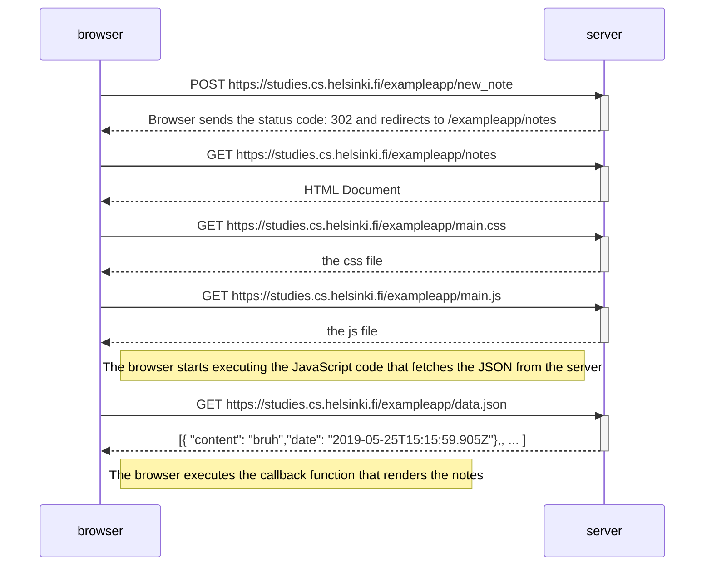

```mermaid

sequenceDiagram
    participant browser
    participant server

    browser->>server: POST  https://studies.cs.helsinki.fi/exampleapp/new_note

    activate server
    server-->>browser: Browser sends the status code: 302 and redirects to /exampleapp/notes


    deactivate server

    browser->>server: GET https://studies.cs.helsinki.fi/exampleapp/notes

    activate server
    server-->>browser: HTML Document
    deactivate server

    browser->>server: GET https://studies.cs.helsinki.fi/exampleapp/main.css

    activate server
    server-->>browser: the css file
    deactivate server
   
    browser->>server: GET https://studies.cs.helsinki.fi/exampleapp/main.js

    activate server
    server-->>browser: the js file
    deactivate server

    Note right of browser: The browser starts executing the JavaScript code that fetches the JSON from the server

    browser->>server: GET https://studies.cs.helsinki.fi/exampleapp/data.json

    activate server
    server-->>browser: [{ "content": "bruh","date": "2019-05-25T15:15:59.905Z"},, ... ]
    deactivate server

    Note right of browser: The browser executes the callback function that renders the notes

```