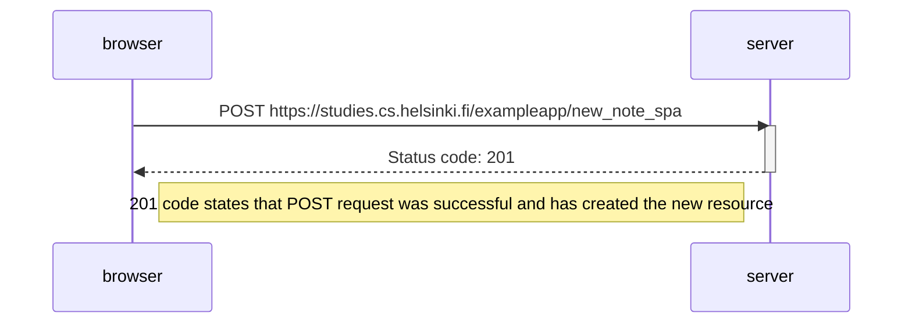

```mermaid
sequenceDiagram
    participant browser
    participant server

   
    browser->>server: POST https://studies.cs.helsinki.fi/exampleapp/new_note_spa

    activate server
    server-->>browser: Status code: 201
    deactivate server

    Note right of browser: 201 code states that POST request was successful and has created the new resource

```